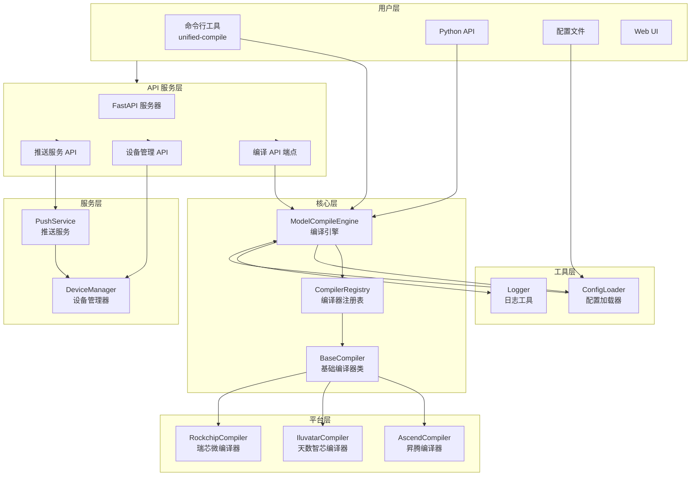
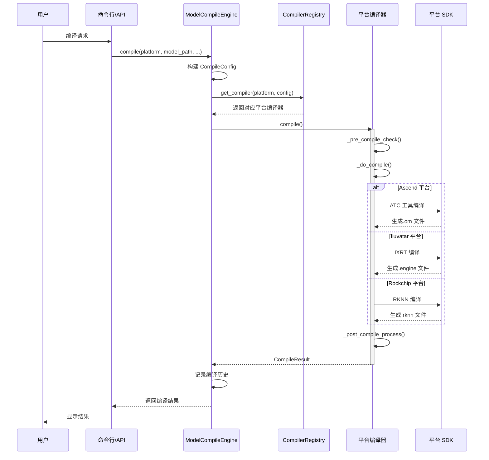
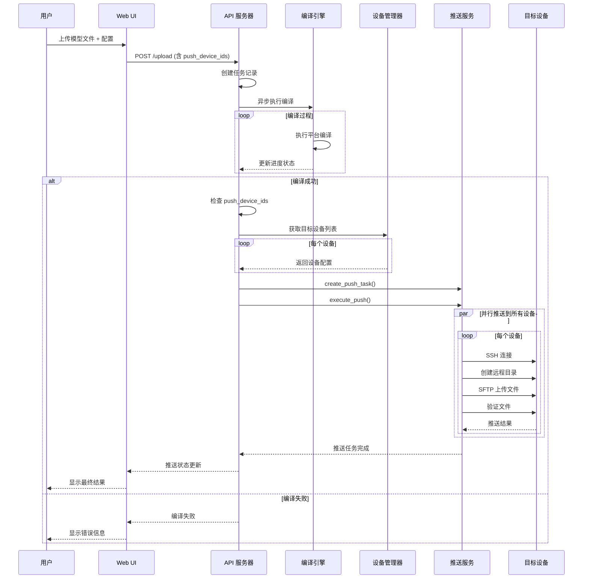
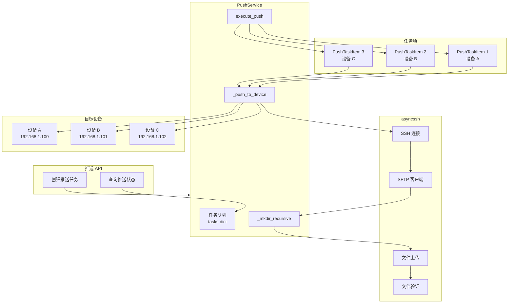
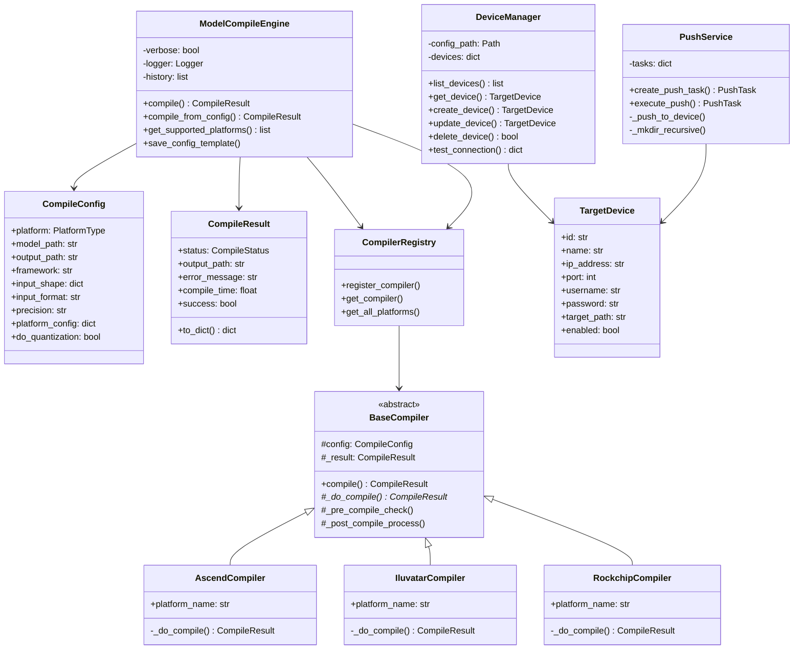
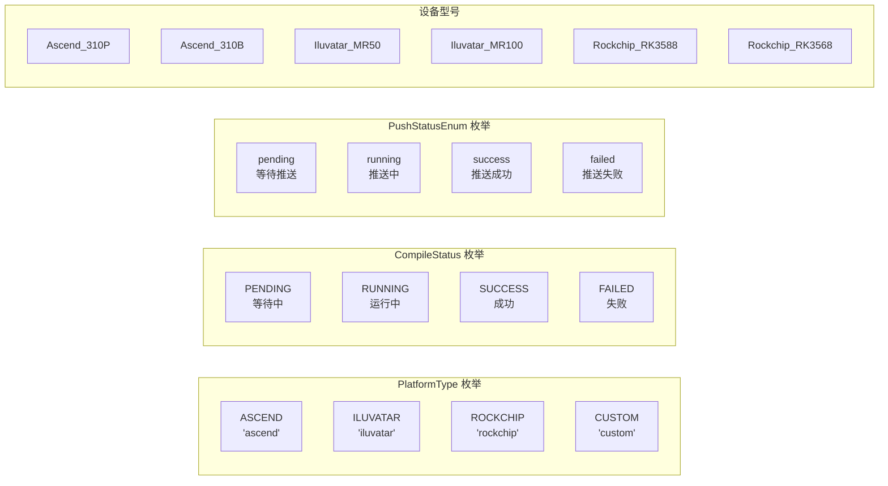
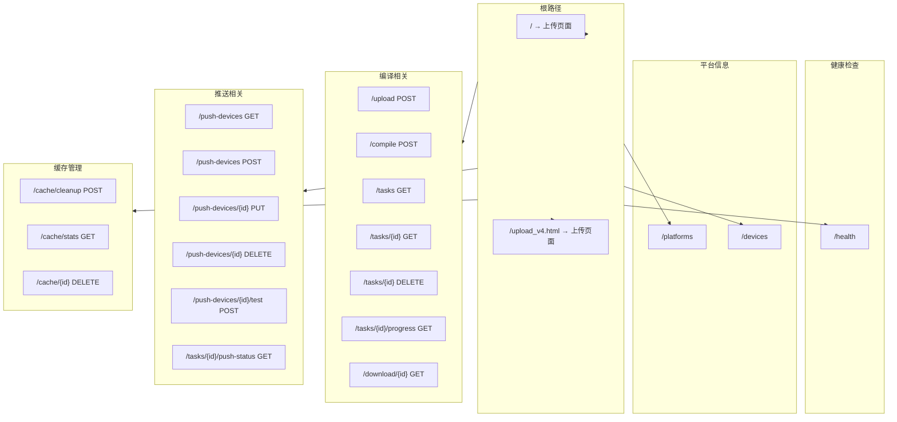
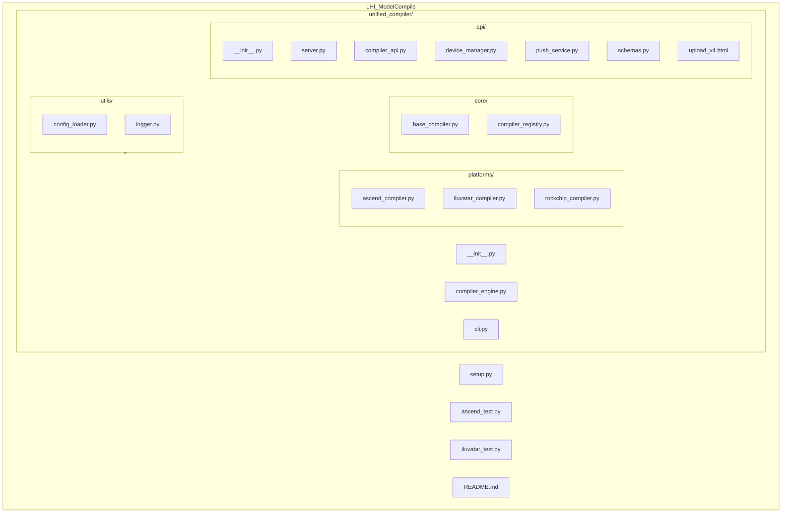
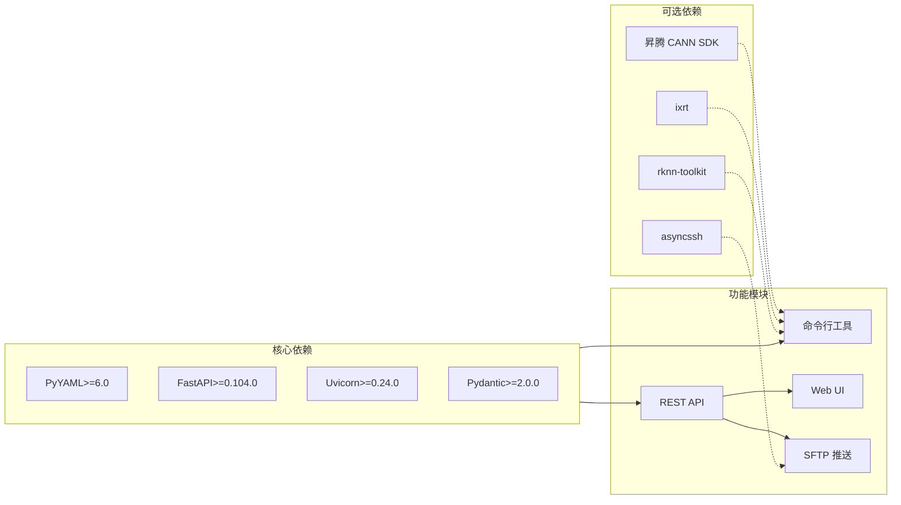

# 统一模型编译框架 - 架构图

## 系统整体架构



## 编译请求处理流程



## Web UI 编译 + 推送流程



## 设备管理数据流

```mermaid
flowchart LR
    subgraph DeviceOps["设备操作"]
        Create[创建设备]
        Read[查询设备]
        Update[更新设备]
        Delete[删除设备]
        Test[测试连接]
    end

    subgraph DeviceMgr["DeviceManager"]
        DM[设备管理逻辑]
        Cache[内存缓存<br/>devices dict]
    end

    subgraph Storage["持久化存储"]
        JSON[devices.json<br/>~/.unified_compiler/]
    end

    subgraph API["API 端点"]
        GetDev[GET /push-devices]
        PostDev[POST /push-devices]
        PutDev[PUT /push-devices/{id}]
        DelDev[DELETE /push-devices/{id}]
        TestDev[POST /push-devices/{id}/test]
    end

    Create --> DM
    Read --> DM
    Update --> DM
    Delete --> DM
    Test --> DM

    GetDev --> DM
    PostDev --> DM
    PutDev --> DM
    DelDev --> DM
    TestDev --> DM

    DM <--> Cache
    Cache <--> JSON
```

## 推送服务架构



## 核心类关系图



## 配置文件结构

```mermaid
flowchart LR
    subgraph ConfigFile["config.yaml"]
        Platform[platform: ascend]
        ModelPath[model_path: model.onnx]
        OutputPath[output_path: model.om]
        Framework[framework: onnx]
        InputShape[input_shape]
        Precision[precision: fp16]
        PlatformConfig[platform_config]
        Quantize[do_quantization: false]
        MeanStd[mean_values/std_values]
    end

    subgraph Loader["ConfigLoader"]
        LoadYAML[load_yaml]
        ParseConfig[parse_compile_config]
        BuildConfig[build CompileConfig]
    end

    subgraph Engine["编译引擎"]
        Validate[验证配置]
        Compile[执行编译]
    end

    ConfigFile --> LoadYAML
    LoadYAML --> ParseConfig
    ParseConfig --> BuildConfig
    BuildConfig --> Validate
    Validate --> Compile
```



## 数据模型枚举



## API 端点总览



## 目录结构



## 依赖关系图


